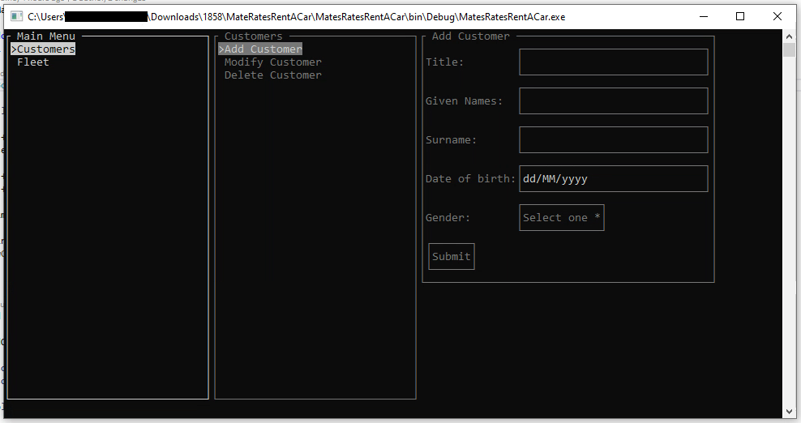

# Mates Rates Rent a Car

Zach Barham (n10482661) -- 4th May 2020

> A rental management system that currently supports adding, modifying and removing customers and vehicles

## Building

This project is set up so it can be built in Visual Studio or any other IDEs that support Visual Studio solution files. To build in VS, open the solution (`MateRatesRentACar.sln`), right click the `MatesRatesRentACar` project in the Solution Explorer panel and select Build (the required files will be put in the `MatesRatesRentACar/bin/Debug`directory).

Note: You may have to build multiple times so that the dependant projects get included.

## Running

You may want to resize the console window that is opened by running the application, otherwise some menus may flow off the edge, and in rare cases the program could throw an exception.

### From Visual Studio

With the solution open, press F5. This will open a console window with the program's GUI rendered.

### Directly

Double click on the `MatesRatesRentACar.exe` file after building, or run it from the command line.

The program should output something like the example below:

### Database files

This program reads from and writes to files in the `Data` directory, relative to the root folder of the solution. This directory will be created automatically if it does not exist, and the program will create the files on exit if they don't exist. The files used are:

- `fleet.csv`: Data about each vehicle owned by the company
- `customers.csv`: Data about every customer
- `rentals.csv`: Links the customers to the vehicles they are renting

## Usage

The program is based around menus and forms, with menus being what you use to find what you want to do, and forms being how you input data. We will call these 'components'.

When a component is active, it will be drawn in a brighter colour than the rest of the app.

Note: Sometimes forms don't automatically focus the first input (shown by the input being a brighter colour than the other inputs) - in this case, pressing tab should focus it.

### Main Menu

This menu lets you choose between the groups of functions the program supports. You can select one of these by pressing tab or vertical arrow keys to cycle through, then enter or the right arrow key to enter into the menu (this is true for all menus). To go up a level in the menus, you can press backspace or the left arrow key.

### Customer Management Menu

This menu is shown under the title _Customers_, and contains actions to add, modify and remove customers.

#### Add Customer

This item displays a form (that can be entered using enter or the right arrow) with the different fields relating to customers. Press tab, enter, or the vertical arrow keys to cycle through these. In the Gender field, press enter to show a list of options, then tab or vertical arrow keys to select an option, then enter to confirm it.

Once all the fields have been filled out, navigate to the 'Submit' button and press enter. If anything is wrong, it will give you feedback, otherwise it will tell you the new ID of the user.

You may press the left arrow key at any time to exit the form.

#### Modify Customer

This item starts by displaying a form which asks for the ID of the customer to modify. Navigate to the 'Search' button and press enter to select that customer (if it can't find them, it will notify you).

It will now show a form similar to the Add Customer form, however the customer ID is included (although it is readonly). Once you have updated any information, select Submit to save it.

You may press the left arrow key to go back to the search at any time, and press it again to get back to the Customers menu.

#### Delete Customer

This form starts off the same as the Modify Customer menu, requesting a customer ID. After searching, it will show information about the customer to help identify them, and ask for confirmation to delete them from the database. It will not allow them to be deleted if they are currently renting a vehicle (although at this time renting is not supported).

### Fleet Management Menu

This menu is basically the same as the customer management menu, however the Add Vehicle form contains a new component - the checkbox. Press enter while it is focused to toggle it.

Note that the Add Vehicle form is quite tall, so you may need to resize your terminal window for it to fit. Some terminals may scroll to show the currently focused component, however this can be jarring.

### Exiting

To save and exit the application, press escape at any time, then choose 'Yes'.

Note that you can press Control+C to kill the application on most terminals, however be careful because this will not save your changes.

## VCS

During creating this application, Git was used to keep track of anything, and to provide a (private) backup on Github. You may open the directory in a Git viewer, or contact me (n10482661@qut.edu.au) to request access to the Github repo. Note: my username is Alduino (sometimes with an underscore at the end).

## Planned to be implemented for Part B:

- Ability to list customers and vehicles
- Search for customer by other attributes to find the ID
- Use multiple classes for vehicle types and have updating default values depending on the type